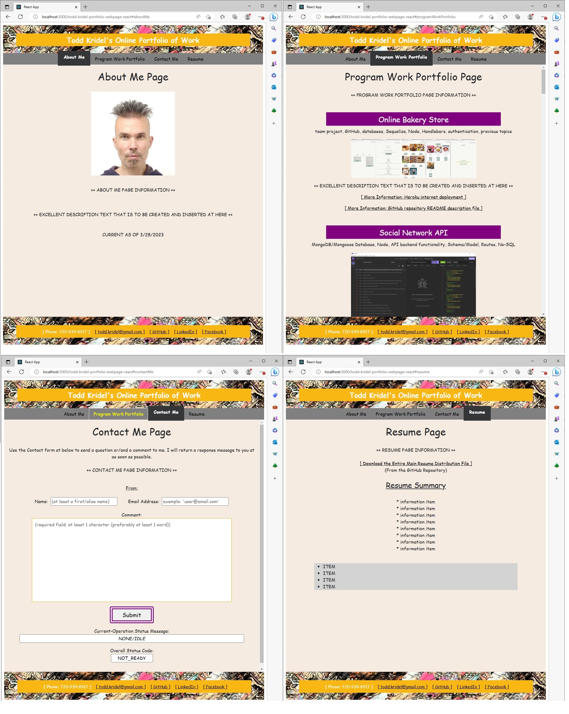

# Todd Kridel's Personal Portfolio of Programming Work Webpage

## Table of Contents
* [Description](#description)
* [Installation Instructions](#installation-instructions)
* [Usage and Features](#usage-and-features) 
* [Credits](#credits)
* [License](#license) 
* [Questions](#questions)

## Description

This current Module 20 Challenge assignment -- a "Programming Work Personal Online Portfolio" -- is a full-feature responsive React-based JSX/JavaScript component refactoring of the [standard HTML/CSS-based personal portfolio website](https://todd-kridel.github.io/Todd-Kridel-Portfolio-Webpage) that was created for Module 2 at the beginning of the bootcamp course and then updated periodically throughout the progression of the bootcamp learning. The portfolio website currently provides/demonstrates only a framework of system structure for the displaying and sharing of personal work information...through an "About Me" personal-details page and a "Work Project List" description page and a "Contact Me" page/form and a "Resume" page...which are accessed through various menus and pages and page elements/functions/features. Most of the website currently contains only template/filler text...but the "Work Project List" page actually does currently contain a complete list of items (pictures and links) that show all of the programming projects that I did during my DU Full-Stack Coding Bootcamp course.

The React refactoring task was a significant and very-challenging learning experience...regarding topics of modular component design and encapsulation for dynamic re-usable effects and functionality; and for validation processes, and for the integration/blending of dynamic HTML/CSS templating and JSX/JavaScript functionality for the enhanced user-interactive application. The concepts were quite different from (almost opposite to) the concepts/methods of website production that have been accustomed to up until this point; a good learning experience even if the topics were confusing and or if not fully understood or if not really fully perceived as being usable/practical/logical. The new React concepts and techniques seem to be complex and redundant or involving extra work/steps...but probably those extra steps in the beginning help to avoid repetition and extra steps and longer/complicated maintenance in the future.

The assignment also involved learning a new website deployment/publishing method that is the npm/node-based "gh-pages" module that functions with/through the GitHub Pages feature that is for React-based website systems. That system seems to be easier and more-efficient for the deployment and sharing of small-scale websites than the procedures that are involved with a Heroku deployment; but the Heroku system and its complexities might allow for the deploying/support of larger-scale more-complex websites.

The objectives -- user story and acceptance criteria items -- of the assignment were as follows:

GIVEN a single-page application portfolio for a web developer

WHEN I load the portfolio...
THEN I am presented with a page containing a header, a section for content, and a footer.

WHEN I view the header...
THEN I am presented with the developer's name and navigation with titles corresponding to different sections of the portfolio.

WHEN I view the navigation titles...
THEN I am presented with the titles About Me, Portfolio, Contact, and Resume, and the title corresponding to the current section is highlighted.

WHEN I click on a navigation title...
THEN I am presented with the corresponding section below the navigation without the page reloading and that title is highlighted.

WHEN I load the portfolio the first time...
THEN the About Me title and section are selected by default.

WHEN I am presented with the About Me section...
THEN I see a recent photo or avatar of the developer and a short bio about them.

WHEN I am presented with the Portfolio section...
THEN I see titled images of six of the developer’s applications with links to both the deployed applications and the corresponding GitHub repository.

WHEN I am presented with the Contact section...
THEN I see a contact form with fields for a name, an email address, and a message.

WHEN I move my cursor out of one of the form fields without entering text...
THEN I receive a notification that this field is required.

WHEN I enter text into the email address field...
THEN I receive a notification if I have entered an invalid email address.

WHEN I am presented with the Resume section...
THEN I see a link to a downloadable resume and a list of the developer’s proficiencies.

WHEN I view the footer...
THEN I am presented with text or icon links to the developer’s GitHub and LinkedIn profiles, and their profile on a third platform (Stack Overflow, Twitter).

Also...the website should provide...

* a single Header component that appears on multiple pages
* a single Navigation component within the header that will be used to conditionally render the different sections of your portfolio
* a single Project component that will be used multiple times in the Portfolio section
* A single Footer component that appears on multiple pages

## Installation Instructions

0. (PREPARATION PREREQUISITE PROCESS) Install the Node.js system software. Make sure that you have a GitHub membership and account to be able to view the repository of the assignment webpage system. The published GitHub Pages view of the website should be accessible on the public internet access URL without a need to have a GitHub membership/account.
1. Install the required involved sub-module application software that is necessary for the running of the repository application...by entering the command "npm i" at a console command prompt of the repository clone directory. One of the module programs that is installed/required is the "gh-pages" extra GitHub deployment system/process...which is used to display (and allow interaction) on the internet the presentation of the personal portfolio. After the installation of the "gh-pages" program...there is an additional requirement of some manual installation/setup steps that will require the settings/verifications in the "Settings" section of the GitHub repository as well as require the usage of the "npm run deploy" script command.
2. Run the website application on the localhost computer port 3000 by using the "npm start" command.
3. Deploy the website application to a GitHub Pages (gh-pages) page by using the "npm run deploy" script command.

### The Additional NPM/Node System Modules that are Used by the Portfolio Website (as listed in the "package.json" file of the system)

{
  "name": "todd-kridel-portfolio-webpage-react",
  "version": "1.0.0",
  "private": true,
  "homepage": "https://todd-kridel.github.io/todd-kridel-portfolio-webpage-react",
  "dependencies": {
    "@testing-library/jest-dom": "^5.16.4",
    "@testing-library/react": "^11.1.0",
    "@testing-library/user-event": "^13.5.0",
    "axios": "^1.3.4",
    "bootstrap": "^5.2.3",
    "dotenv": "^16.0.3",
    "gh-pages": "^5.0.0",
    "react": "17.0.2",
    "react-dom": "17.0.2",
    "react-scripts": "5.0.1",
    "web-vitals": "^2.1.4"
  },
  "scripts": {
    "predeploy": "npm run build",
    "deploy": "gh-pages -d build",
    "start": "react-scripts start",
    "build": "react-scripts build",
    "test": "react-scripts test",
    "eject": "react-scripts eject"
  },
  "eslintConfig": {
    "extends": [
      "react-app",
      "react-app/jest"
    ]
  },
  "browserslist": {
    "production": [
      ">0.2%",
      "not dead",
      "not op_mini all"
    ],
    "development": [
      "last 1 chrome version",
      "last 1 firefox version",
      "last 1 safari version"
    ]
  }
}

## Usage and Features

To use this application/website from a laptop/desktop computer...at after when installing the application and then using the "npm start" command to start the application...and then accessing localhost port 3000 view/tab of the webpage browser window...

1. Access/View the default-view "About Me" page by using the corresponding tab/button of the menu bar as-necessary.

2. Access/View the "Program Work Portfolio" page by using the corresponding tab/button of the menu bar as-necessary. Try to click the contained pictures for larger/closer views and try to click the contained "Additional Information" links.

3. Access/View the "Contact Me" page by using the corresponding tab/button of the menu bar as-necessary and try to click and type in/to/from the various fields and try to click the "Submit" button and watch the contained status fields for informational messages that result from validation processes that were programmed into the corresponding system component. 

4. Access/View the "Resume" page by using the corresponding tab/button of the menu bar as-necessary. Click the contained download-file button/link and then view your "Downloads" folder to view the example resume file content.

5. Try to resize the application window if the application is being used on a laptop/desktop computer...and view about how the application display responds to the size changes.

6. Try to view the application on a smartphone screen.

Otherwise...to use this application/website from the published GitHub Pages system...open a webpage browser window and then navigate to the URL "https://todd-kridel.github.io/todd-kridel-portfolio-webpage-react".

The website appears as follows:

[ 

## Credits 

* Continued informational and cognitive struggle and persistence were required.

## Questions

* If you have any questions you can reach me at GitHub account "Todd-Kridel".

## License

*   
* Copyright 2023 Todd Kridel

MIT License

Copyright (c) 2022 DU Full-Stack Web Development Coding Boot Camp

Permission is hereby granted, free of charge, to any person obtaining a copy
of this software and associated documentation files (the "Software"), to deal
in the Software without restriction, including without limitation the rights
to use, copy, modify, merge, publish, distribute, sublicense, and/or sell
copies of the Software, and to permit persons to whom the Software is
furnished to do so, subject to the following conditions:

The above copyright notice and this permission notice shall be included in all
copies or substantial portions of the Software.

THE SOFTWARE IS PROVIDED "AS IS", WITHOUT WARRANTY OF ANY KIND, EXPRESS OR
IMPLIED, INCLUDING BUT NOT LIMITED TO THE WARRANTIES OF MERCHANTABILITY,
FITNESS FOR A PARTICULAR PURPOSE AND NONINFRINGEMENT. IN NO EVENT SHALL THE
AUTHORS OR COPYRIGHT HOLDERS BE LIABLE FOR ANY CLAIM, DAMAGES OR OTHER
LIABILITY, WHETHER IN AN ACTION OF CONTRACT, TORT OR OTHERWISE, ARISING FROM,
OUT OF OR IN CONNECTION WITH THE SOFTWARE OR THE USE OR OTHER DEALINGS IN THE
SOFTWARE.

